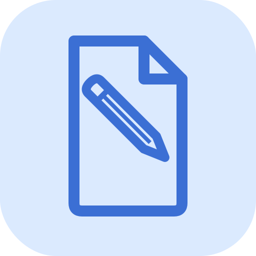

# PDFree

A free, open-source PDF toolbox desktop application built with Python and PySide6.



## Features

- **View PDF** — Full-featured viewer with zoom, rotation, text selection, search (Ctrl+F), thumbnails, TOC sidebar, annotations, signature drawing, and form filling
- **Excerpt Tool** — Load multiple PDFs, drag to select rectangular regions from any page, and collect them into a new PDF
- **Split** — Split a PDF by page ranges, every N pages, or bookmarks
- **File Library** — Persistent library of your PDFs with folders, favorites, and recent files
- **PDF to CSV** — Extract tables from PDFs into CSV files

More tools (merge, crop, watermark, password, OCR, etc.) are shown in the UI and will be added in future releases.

## Requirements

- **Python 3.11 or newer**
- Packages listed in `requirements.txt`

Tested on **Windows** and **macOS**. Linux should work but is untested.

## Installation

```bash
# 1. Clone the repository
git clone https://github.com/Fioerd/PDFree.git
cd PDF-Suite

# 2. Create and activate a virtual environment (recommended)
python -m venv .venv

# Windows
.venv\Scripts\activate

# macOS / Linux
source .venv/bin/activate

# 3. Install dependencies
pip install -r requirements.txt
```

## Running

```bash
python main.py
```

## Project structure

```
main.py            # Entry point and home screen
view_tool.py       # PDF viewer
excerpt_tool.py    # Excerpt / region-capture tool
split_tool.py      # Split tool
pdf_to_csv_tool.py # Table extraction to CSV
library_page.py    # File library / dashboard
icons.py           # Bundled Lucide SVG icon set
colors.py          # Shared design-system colour palette
utils.py           # Shared Qt utilities
```

## License

[MIT](LICENSE)
